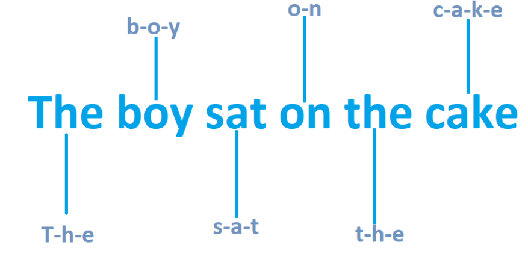
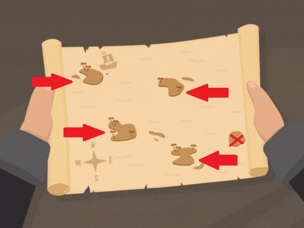
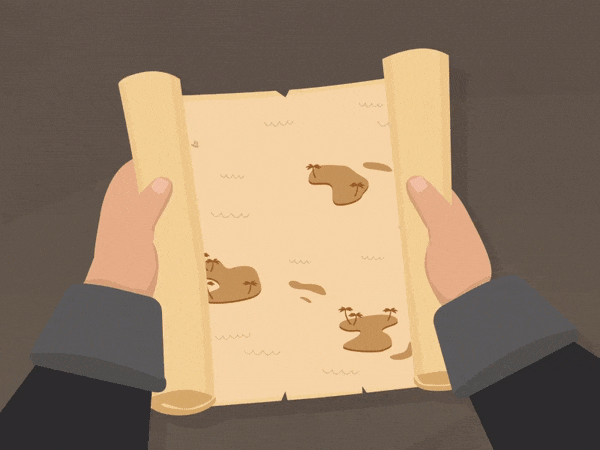
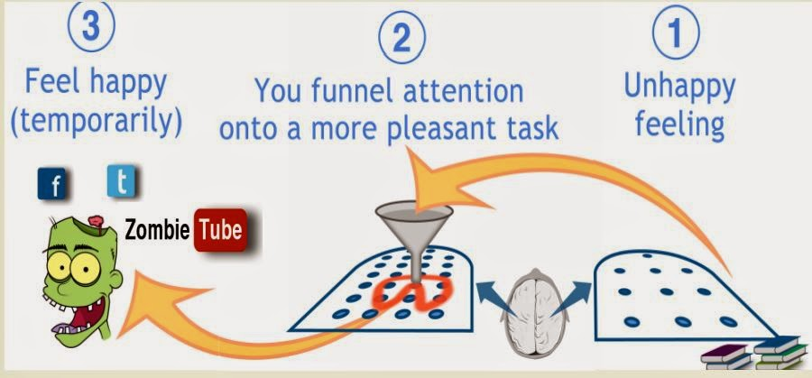

<h1>
How to Learn
</h1>

I once heard someone say when given a how-to guide where the person gives you tips on how to perform a task better, you shouldn’t approach it as a step-by-step guide you should follow in a meticulous order where you make sure you accomplish each tip every time like a robot given instructions to follow but rather use the tips as a mental framework, meaning use these tips as a guide in your study sessions, take what works for you and apply them when needed, don’t burn yourself out making sure you follow each of these tips to the letter in every study session. This blog aims to give you powerful mental tools to help you in whatever subject you’re trying to master. 

 ## How we learn

In order to get good at anything in life, understanding it is an integral part of the getting good process. So, to begin we would need to understand how we learn.  There are two modes our brain goes through in the learning process. The **focus mode** and the **diffuse mode**. To help explain this I’ll be using the renowned Doctor Gregory House (a fictional character from the TV show House MD).

 |  |
 ------------------------------------------------------------------------------------------------------
 |  &emsp;	&emsp;	&emsp;	&emsp;	&emsp;	&emsp;	&emsp;	&emsp;	               <strong>Focus Mode</strong>     |

 |  |
 ------------------------------------------------------------------------------------------------------
 |  &emsp;	&emsp;	&emsp;	&emsp;	&emsp;	&emsp;	&emsp;	&emsp;	               <strong>Diffuse Mode</strong>     |

 |  |
 ------------------------------------------------------------------------------------------------------
 |  &emsp;	&emsp;	&emsp;	&emsp;	&emsp;	&emsp;	&emsp;	&emsp;	               <strong>Focus Mode</strong>     |
 
<h3>
<strong>[Learning involves going back-and-forth between these two different modes of thinking]</strong>
</h3>

<!-- 
 -->

<!--  
 
 -->

<!-- <pre>                     <strong>Focus Mode</strong>                                                <strong>Diffuse Focus</strong>                                                  <strong>Focus Mode</strong> </pre>
<h3>
<strong>[Learning involves going back-and-forth between these two different modes of thinking]</strong>
</h3> -->

The <strong>focus mode</strong> is when you focus intensively on what you are trying to learn in other words you blur out everything and give your full attention to what you are trying to do, traditionally speaking this is what we as a species have come to understand as learning but in reality, it is only part of the learning process.

The <strong>diffused mode</strong> is when we stop putting our full attention on what we are trying to learn/understand/solve, we let our brains wander off so to speak but at the back of our minds every now and then think of the problem.

In the TV show, House was notoriously known for doing this, when he was faced with a problem, he first focused intensively on it, trying to understand it and come up with solutions, after he had done this for a while, he would wander off into some other activity not focusing so intensively into the problem as his colleagues, he would go back and forth between these two modes until the problem was solved, this often led people into thinking that he was not a serious Doctor, how could such a sluggard be called one of the best Doctors, this so-called lazy attitude was one of the secrets to his brilliance, House had come to understand that going back and forth between these two different modes was what allowed him to come up with ideas to situations which his colleagues had rendered as hopeless for the patient.

Subconsciously the brain does this, but when we notice that we aren’t focusing as intensively as before on a task we either get mad at ourselves saying we are lazy (or at least I used to get mad at myself) and immediately force ourselves right back into the focus mode and when things don’t end up making sense we then proceed to either put off the task for a while or forever (procrastination).

But what we rather need to be doing is interleaving these two modes of thinking in our learning process, we focus intensively on a task for a while, after that allow our brains to enter the diffuse mode of thinking. We can intentionally invoke the diffuse mode of thinking by allowing our brains to wander off by actively going for walks, during our baths, basically anything we do where we aren’t as focused as before on the task but rather allow our brains to come up with new ideas or means of understanding the topic in a less intense mode.

To show you the effects of diffuse mode of thinking, take the scenario of when you have been in a friendly debate with a friend or family member and you’re trying to put your point across on why your opinion may be more valid than the other person's, after the conversation, perhaps when bathing in the bathroom new ideas/better ideas pop up in your brain on how you could have better explained a point or an idea to convince the people involved in the conversation that you really were on the right track, these ideas may come to as anywhere, for this example it’s in a bathroom but I’m sure this has happened to you while even falling asleep on your bed, your brain starts coming up with new, more and sometimes better points. This is what we are trying to invoke in the learning process, by interweaving both diffused mode and focused mode—  we tend to come up with new ways of solving problems and also it helps us in the understanding stages of trying to consolidate an idea down. 

 

 <strong> 
Interweaving these two modes would lead us in reaching the Aha!!! moments of understanding and solving problems faster.</strong>

 

## Common Sense but not really common sense

Where I am from, there is a popular saying that *“common sense is not common to common people.”* Most of the time the thing that you think everyone would have checked off their checklist rather tends to be ignored, it could be that we view them as so simple that how could something so minute have a great effect, but actually the minute things matter. Make sure you check these off your list frequently:

* Sleep/Naps – Sleep is not for the weak but rather for the wise, even science backs this claim, sleep is important in the learning process. How it does this is through some of the following:
    -	When we are awake, our brain creates metabolic toxins that make it harder to think, the way we naturally get rid of the toxins is by sleeping. This is a major reason why we need sleep, cause without sleep, trying to learn something is harder when the toxins are in our brain
    -	When we sleep your brain (your subconscious mind) goes over multiple times what you’re trying to learn, subconsciously you’re strengthening the ideas of what you’re trying to grasp, this is why you may have noticed that sometimes when you sleep after a study session, you end up dreaming about what you were learning when awake. For instance, if you program, I am sure there has been a point in your life where you started to dream about the code, this happens in many other disciplines— your subconscious mind is at work. 
    -	It’s a way of invoking diffuse mode of thinking, when we sleep it leads to a form of deactivation of our focused mind, ideas we were trying to understand or solve drift off into the back of our minds so to speak, allowing other parts of our brain  (other chunks of information we weren’t using in the focus mode) to chime in into the problem to help in the understanding and problem-solving process. That's why you're always advised to **sleep on it** whenever you have to make a major life decision, you never know what edge/corner cases your focus mode may have missed.

* Exercise – When we exercise, new neurons are born in our brain, these neurons play a key role in helping us chunk information (remember information), hence exercise not only plays a role in your physical health but also mentally too. Besides, exercise can be used as a means of actively engaging in the diffuse mode of thinking, to help you understand a problem, come up with new ideas to approach a problem and also can be used as a way to step away from a problem in order to come back at it and be able to look at the problem with *new eyes* so to speak.

* Learning through Osmosis – Another popular saying, “show me your friend and I’ll show you your character”. In other words surround yourself with people that you want to learn from, place yourself in an enriched environment where you’ll be able to engage in intellectually stimulating conversations, in the 21st century this could even be done online, join communities such as Subreddits, Discords, Quora spaces etc., where you’ll be surrounded by knowledgeable people in a specific domain, their knowledge will gradually start to disperse into your ways of thinking. The science behind it is that when we are in an enriched environment the connection between neurons in our brains are strengthened. This is why academics like to put themselves in Universities or research companies to work, this leads them to come up with new and better ideas, there their colleges not only give them good advice or challenge them to be better but also subconsciously have a positive impact on their creativity and mental development, the is an osmosis of learning in such environments.

* Take breaks – Contrary to what some people may believe, you actually aren’t meant to be in serious mode 24/7, the human body wasn’t made to be in intense mode throughout the day (that’s why we have habits, more on that later), burnout is a common thing you hear about in modern society, where it seems that if you aren’t *“hustling”* or *“on that grind”* you are wasting precious time. Take breaks, it’s a simple solution but an effective solution, breaks not only refresh as but they can help us to actively interweave diffuse mode of thinking when we are trying to learn /understand /solve a problem, another benefit of breaks is that it helps you to be able **look at the problem with new eyes**, when learning we sometimes can get stuck in Einstellung (a fixed mindset), the solution to the problem is not on the path we currently are on or there is a better way to solve a problem or even understand the problem, taking frequent breaks would help us in breaking out of this fixed state of mind. 

* Failure is part of the journey – One reason why children are faster at learning than adults is that they aren’t afraid to fail, they don’t care about looking dumb in front of others, feeling dumb or looking stupid is part of the learning process, no one is born with everything in their heads, we learnt what we know gradually, hence we went through the feeling dumb stage before we got to where we currently are, what we need to focus on is **Grit**—  being persistent all though we may seem lost for some time, grit is what we need to put into practice in order to get out of the maze of learning something new.

* Deep Work: Cal Newport talks about this in his book [Deep Work](https://www.google.com/search?q=Deep+Work&rlz=1C1GCEA_enGH888GH888&oq=Deep+Work&aqs=chrome..69i57j69i59l2.439j0j7&sourceid=chrome&ie=UTF-8). It’s essentially focusing on one task at a time, simply put when studying, your full attention should be on studying, eliminate all other distractions such as your phone which always wants your attention (it’s such a needy device if you think about it <!--:telephone_receiver: --> &#128222;&#128227; <!-- :mega:--> **Give me attention!!!**). It’s important to note that it is ideal to be in one mode at a time (either focus or diffuse), also in order for the diffuse mode to be effective in a specific area of study, you must have first gone through the focus mode stage, this would help the brain in painting a picture of the problem domain before it starts recommending solution in the diffuse mode. Hence the need for deep work slots.

## How to Learn

 
 
 
 
 
 

How many of us have ever gone to class and what the teacher taught on that day we actually understood it— we had an Aha Moment, but when we were asked a question either on a test or by someone to explain it to them, we are lost (either we had forgotten the material or we realize that the are some gaps in our knowledge). Just like how a doctor would recommend medicine for an illness you may have, the recommended cure to this problem is forming a **chuck**. 

 

 <strong>What is a Chunk –</strong> Scattered bits of information linked together through meaning. When reading a sentence,  i.e. **“the boy sat on the cake"**, you don’t necessarily look at each letter one-by-one <strong>&#8594;</strong> then combine each letter to form a word <strong>&#8594;</strong>  after think about the meaning of the word <strong>&#8594;</strong>  then its pronunciations <strong>&#8594;</strong>  after perform this same routine for each word in a sentence <strong>&#8594;</strong>  then how to read all these words together with the right intonation in order to convey meaning. Instead, your brain does all of this in less than a second, you didn’t have to struggle with this task, it may seem very simple to do right now but when you were first beginning to learn how to read, it would have been a daunting task, but now it’s as simple as ABC, that is because you have chunked this skill down.  (you have been exposed to these words multiple times that they are now strongly fermented in your long term memory), you don’t have to go through the same struggle as someone who is now learning English or even their first language, whenever or wherever you see these words, your brain immediately knows what they mean and how to pronounce it (this trait in humans, turns out to be very beneficial, if we didn’t have this, life would have been far more difficult). This is how we should learn, using this habit-like feature called chunks to help us in our learning journey.

 <strong>How to form a chunk –</strong> The are three stages to forming a chunk:

* Focus – Remove all distractions, you want to enter the focus mode of thinking, put yourself in an environment where you can focus on the task at hand. 
* Understanding - It’s easier to do something when you actually know what you’re supposed to be doing. You should know what the end goal is— what you are trying to accomplish (Grasping the main idea/ideas of what you are trying to learn). You can achieve this by:
    - Glancing over the contents page in a book (what does the heading of the chapter you’re on mean) <strong>&#8594;</strong> glance over the subtopics <strong>&#8594;</strong> look at the images in the chapter <strong>&#8594;</strong> read the summary of the chapter <strong>&#8594;</strong> watch a video on the topic. 
    -	Another example is if you are solving a math question in a specific topic— look at someone else’s worked out example of questions under that topic.
    -	 In programming – you’re learning about how to use a new function, lookup someone else’s walkthrough of them using that function to solve a problem (YouTube video / documentation / blog post)
    -	 In learning a song– listen to someone play that song. 
    
  
  A way you can think of this stage is that we’re exposing our brain to the material in order for it to try and paint a picture of the environment (forming the big picture of the problem domain), the picture doesn’t have to be fully painted at this stage but some key features of the picture have to be formed.
  
   

  Using an analogy of a treasure map, we can view the Understanding stage as filling in our map with vital landmarks in the environment (in the above image, that would be the islands). Understanding the problem domain is grasping the main idea/ideas of what you are trying to learn, thus involves knowing about the key stages (islands) in our problem domain (environment). It’s important to note that during this stage, the paths to go from one location (island) to another may not be drawn out yet (why we move from one island to another island in order to reach our desired destination). This is why after the understanding stage; the next step is vital in order to deal with *illusions of competency*.

<!-- 
  
 -->

   

* Practice –  Now that we (our brain) knows about some of the subtopics we’ll cover (locations on our map that we may need to pass through to reach the end goal), this is where we start to paint in the paths to connect the islands on our map. The practice stage is about testing yourself to see if you truly understand what you’re learning or whether you have fooled yourself into thinking you actually understand the topic at hand. How we can Practice is by testing ourselves to help answer the questions of: 
  - Do I know how to get from one island (subtopic) to another island?
  - Why do we do this in the grand scheme of things (The bigger picture)?
  - Are there other ways of getting from one island to another island (there could be multiple paths we can follow in order to move from one location to another)?
  - Which is the most efficient path to reach the end goal?
  - When do I use and when do I not use certain paths when I am trying to get to a certain destination?
  - Can I do this without anyone holding my hand (illusions of competency)?

  **Note**: We are not only concerned about the steps you take at each subtopic (what must be done there) but also, we’re concerned about the interconnections between the subtopics (the paths) in order to gain **context of the big picture.**

   

 <strong>Importance of chunks –</strong> Why you should form a Chunk, because they are the habits of neuroscience. Chunks can be very useful in the sense that:

We can easily recall information to working memory in order for us to use it.

We can transfer Chunks we have acquired into other domains to help us grasp them (i.e. your understanding of Math can help you more easily understand Computer Science).

You increase your arsenal of tools to use when you enter the diffuse mode of thinking (people that always seem to come up with different ideas for a problem have multiple chunks they can draw from to use in many different domains). 

 

**Key Ideas to Help you with Chunking Information** 

* Active Recall –   For anyone interests Youtuber/Doctor Ali Abdaal has a great video where he talks about [Active recall](https://www.youtube.com/watch?v=ukLnPbIffxE&ab_channel=AliAbdaal), Active recall is simply trying to remember what you’re studying without referring to the source material, this— I repeat *THIS* is one of the most effective ways of avoiding *illusions of competency*, the simple act of forcing your brain to try and remember is key in forming a chunk (Gaining mastery).

* Spaced Repetition – Learning is like building muscles, you can’t just go to the gym once and expect to leave looking like Mr. Olympia, you can spend your whole day in the gym (24hrs) to get that bod but I’m pretty sure you’ll still not end up like Mr. Olympia. The truth is learning takes time, forming chunks takes time, you’ll have to do it multiple times before you start noticing its effects. The best way to do this is by spacing out your learning, which means not pulling an all-nighter and expect to remember everything you learnt in a week’s time. The brain consolidates and reconsolidates information into long term memory when we sleep, this is why it is effective to space our learning over a period of time. In order for us to effectively chunk information into long term memory, memory consolidation and reconsolidation must take place. For another great video on the topic, I’ll recommend another of Ali Abdaal's videos on [Spaced Repetition.](https://www.youtube.com/watch?v=Z-zNHHpXoMM&t=128s&ab_channel=AliAbdaal)

* Testing yourself – Testing yourself falls in line with Active Recall, doing problem sets, assignments, practice quiz, basically testing yourself through any medium related to your domain of study helps you to 
  * Gain Mastery over the material
  * Know when and where not to use a technique (i.e. in mathematics)
  * Know your weak points so that you can practice “deliberate practice”
  * Remedy for *illusions of competency*

* Interleaving –  When we mix different topics in the same study session. Instead of trying to master one topic before we move on to another, we want to mix up our studies with different topics, this would help us in the long run of fighting against illusions of competency. The brain is very good at recognizing patterns, but when we interweave for instance questions from different topics, when we try to answer them (testing ourselves) this time around the same cues that helped us to get the answer for a question this time may not be there. Take the scenario where you’re studying mathematics, after each topic the is usually a set of questions on that topic at the end, this can be a cue to the brain, you associate the title of the topic to the solution you must perform in order to answer the question but on exam day, you wouldn’t get questions saying this specific question is under a specific topic, the questions are all randomized (interleaved), hence your original cues you used to signal to yourself on what actions must be taken are no longer there (you fooled yourself into thinking you had mastery), interleave different topics or even questions to answer helps us to truly gain mastery of our chunks of knowledge so that we can apply them whenever and wherever needed without needing a big heading telling us— *Oh, by the way, a method you can use to solve this problem is so and so*

* Overlearning is a think – Side effects include Einstellung (a fixed mindset)— (from [Wikipedia](https://en.wikipedia.org/wiki/Einstellung_effect)) Einstellung refers to a person's predisposition to solve a given problem in a specific manner even though better or more appropriate methods of solving the problem exist. Simply put it’s a waste of time— you aren’t learning anything new. Overlearning is what holds average students back from being great students, top scorers manage to cover the course material as much as possible, they try to cover every topic instead of just focusing their attention on the material they already know.

* Deliberate Practice – When you test yourself but not on the things you got correct in a previous exercise (things you know you know), that would just lead to overlearning but rather noticing your weak areas and work on them. We turn to lean towards things we are comfortable with, things that don’t trigger discomfort in our brain, but rather what we want to be doing is diving into the deep end so to speak, putting ourselves in an environment where we would experience discomfort because that’s how we grow. 

* Illusions of Competence – This is when your brain fools you into thinking you truly know the course material but in reality, you actually don’t. Remember that the brain is very good at recognizing patterns, this often tricks us into thinking that we actually know something but in retrospect you may just be recognizing patterns. Ever had the experience of seeing a face you know, perhaps you were walking and you and someone else locked eyes, you know that you have seen this specific face before but where in the world you guys met, you just can’t put a finger on it, sometimes it comes to us later on (diffused mode) but other times we never remember but you know you know the person (pattern recognition), this feature of our brain often leads us into thinking we truly know something but actually we don’t, when the time comes for us to recall it, we’re stuck as a deer caught in front of headlights, we then proceed to inwardly say “I knew the answer but I just couldn’t remember it”. This is why active recall/testing ourselves is very germane, it provides us with an effective technique to deal with illusions of competency. Activities that commonly lead us into the state of illusions are highlighting, rereading and concept mapping.

# Game Plan for Procrastination

Now that we have understood how to effectively learn (chunks) and how not to learn (i.e. illusions of competency), we quickly come to realize that learning takes time. An analogy used to represent the act of learning is that *it’s like building a wall*, when it comes to building walls— they are constructed brick by brick, in learning we want to avoid cramming but rather learn bit-by-bit. Take the phrase for instance “_**Chew <strong>&#8594;</strong> Pour <strong>&#8594;</strong> Pass <strong>&#8594;</strong> Forget**_”, this phrase is associated with cramming, how many of us have crammed the night before an exam (**Chew** the material), then during the exams— we quickly write down what we memorized the night before (**Pour** the material), and somehow get a passing grade (**Pass**) but not so long after the exams you can’t remember what you learnt (**Forget**). This way of learning may have helped you in the past for easier classes but the higher you get, you quickly come to realize that this way of learning has held you back, this is because in your higher classes most likely prerequisites would be required in order to do well in them, your teachers would expect you to have already learnt something before taking that class, but your last-minute cramming lifestyle has created gaps in your knowledge domain, either you have forgotten what you learnt from the previous class because you didn’t chunk the information bit-by-bit or you never managed to cross out that specific topic because during your last-minute cramming session you never managed to get that far into your notes. Procrastination leads to cramming, therefore procrastination in our lives— especially when it comes to being an effective learner would have to be addressed, habitual procrastination can be detrimental to our life in the long run, think of it as smoking, once we start, it’s very hard to stop. This is because the reward gotten from procrastination is instant (nicotine) but the long-term effects may not show right away, eventually its detrimental effects start showing.

<strong>Understand why we procrastinate –</strong> Again just like how a doctor would first have to understand an illness before they can recommend an effective cure, in order for us to treat procrastination, let's first understand what procrastination is. Procrastination simply put is a **“habit”**. A habit is a routine of behaviour  that is repeated regularly and tends to occur subconsciously (from [Wikipedia](https://en.wikipedia.org/wiki/Habit)). Habits are done subconsciously, most of the times we don’t even recognize that an activity we’re currently doing is a habit of ours— we just do them, the beauty of habits is that they are energy savers, we don’t have to exert much willpower into doing them— we just do them (think of them as chunks, when we chunk information down, we don’t have to exert a lot of willpower to recollect it)

<strong>How do we form a habit –</strong> Now that we know what procrastination is (A Habit), knowing this is what is going to help us find our cure. It turns out that an effective cure for procrastination (A habit) is another **Habit**. Yep, you can use a habit to solve a habit problem.  The next question then should be how do we form a habit. There are four stages in building a habit:

* Cue – This is what triggers the habit. It can be anything, a place, the time of day, a scent, a feeling etc. For instance, getting a notification alert on your phone, which then leads you to pick up your phone, which then leads to an endless scroll on Twitter/Instagram/YouTube/Reddit … the cycle continues. The game plan for us learners would be to find a good cue for activating our study routine.

*	Routine – This what we do after the cue, this is probably the hardest part, here you may require willpower to start the routine but remember over time it would become part of you (a Habit), at first it may not be a smooth transition from cue to routine because this is not yet a habit, but eventually. Something that I have found comforting is that once you have managed to start, in due time you’ll be in a flow state, where the resistance to continue isn’t as hard as beginning. Another comforting thing to know about beginning a routine is that majority of people in this world face the same resistance in **beginning**, even people you’ll think they find it easy to do a specific task because that’s what they are well known for, still feel the same resistance in **starting**.  The trick is all though you don’t feel like it, all though you may never feel like doing it, ignore your feelings for a few seconds, you can’t always be guided by your feelings because just like you, sometimes they turn out to be wrong. Majority of the resistance you’ll face is in **beginning** but once you manage to overcome this hurdle, you’ll be off to the races. An incredible conversation about feelings and how they can mislead you and how to deal with them was given by [Mel Robbins](https://www.youtube.com/watch?v=supVPLOHWPg&ab_channel=LewisHowes)

* Reward – This is key in making the habit stick, the needs to be a reward at the end of the routine. This is why we procrastinate, when we procrastinate (our bad habit), there is a reward in the act of procrastination — instant gratification, we crave the reward, the reward is what drives our bad habit. 
 
Now to form a good habit, we would also need a reward to help drive this habit— the reward doesn’t have to be instant like the dopamine we get when we browse our favourite web application the second we feel tense or bored but it could be delayed gratification, i.e. when done with a **PROCESS** (more on processes later) we spend the rest of our day doing whatever our heart pleases (with reason of course), in other words having a **quitting time** could be an example of a reward, find a reward that works for you.

- Belief – You should have a growth mindset and not a fixed mindset, know that it is possible to form good habits in order to manage procrastination. Confucius once said: “The Man Who Says He Can and the One Who Says He Can’t Are Both Right”. To help with building a good belief system, surround yourself with people who you would like to be like, there is an osmosis effect of surrounding yourself with the right people, their characteristics gradually rub off on you. Try and do this both physically and online, but if for some reason you can’t do the former try as much as possible to do the latter, we’re in the 21st century— you can connect with amazing people all around the world through the internet, join a Discord channel, a Subreddit, a Quora space, subscribe to Youtubers who are in your field of interest etc. What a time to be alive &#128524;.

 
**To be clear, the game plan to fight against** 
**procrastination then is to form a new habit.**
<!--    -->

  

To learn more about habits, a great book to read is [The Power of Habit](https://charlesduhigg.com/the-power-of-habit/) by Charles Duhigg.

<strong>Helpful Information to note in your fight against procrastination.</strong>

*	Process Over Product – When it comes to your brain, it’s much more willing and likely to do something when it views the task ahead in the form of a process and not as a product. A **product** is an end goal you try to achieve (i.e. during this study session my goal is to cover topic A and topic B). How many times have you proceeded to set end goals for a study session, during the planning stage you had every intention of achieving your goals before the study session ends, but when it came time to do the things you planned to do you quickly realized that the resistance to start the journey was massive, this led you to procrastinate— pushing the task further and further back (remember habitual procrastination can be detrimental in the long run). What you should have rather than when you were planning to undertake this study session was use a *process strategy*. **Process** is when you tell yourself that today I’ll be studying this subject for 2 hours and that would be it, you don’t set a fixed goal, but rather allocated a slot of time in your day to work (i.e. Monday morning from 9 to 10 I’ll study subject A, during the study session I’ll have 25-minute sprints of focused work, after take 5-minute breaks), your brain prefers this format over a hard-fixed objective to achieve. This is why the famous *“Pomodoro technique”* works, it allows your brain to ease into a study session not focusing on— I have to complete so and so before I end the study session, but rather it is comforting to the brain to know that it only has to put in work for a specific amount of time, rather than forcing it to complete a task. Remember *Process over Product*.

* Eat your frogs first thing in the morning –  In other words, to work at your most important and most difficult task first. This helps you use your best energy to accomplish great things([Urban Dictionary](https://www.urbandictionary.com/define.php?term=Eat%20the%20frog)). Studying can be hard, it demands effort to start most times, try this as an experiment, let studying be one of the first things you do when you wake up. It may sound dreadful at first but just try it, before you start your endless scroll of social media, hit the mental gym (study). This single activity can be a great *habit* to form as a way of defeating procrastination (your cue— when you wake up). When you wake up, your mind is usually clear (remember the power of naps), you don’t feel as sluggish as someone who has been up for a while, your brain easily soaks up information, your thinking is clearer, most importantly the resistance to start a task in the morning is not as massive as during the day. Eat your frogs when you wake up, just try it.

* Plan – Winston Churchill once said: “He who fails to plan is planning to fail.” Plan your day, from plain observation, many people who seem to be on top of their game always admit to planning. **Plan the night before** not in the morning, this would allow you to save willpower the next day for other tasks, it also allows you to eat your frogs as soon as you wake up, don’t fool yourself into thinking that, being busy planning means that you’re being productive— or worse make it another way to procrastinate, **plan the night before**. When you plan you don’t have to exert willpower before you start a task thinking what am I going to study today, when am I going to study today, where am I going to study today, or even how am I going to study today— would I use the first 15 minutes to actively recall or would I be going over what I learnt two weeks ago (spaced repetition). You would already have the plan for the day, the would-be no need to now have to jump a hurdle before you start tackling the main task, you can just ease yourself into the process of studying.

* Distractions may arise – It’s good to know that distractions may arise no matter how hard you try to avoid them but the trick is that when they do, just allow them to wander past your brain, not given them any more attention, try your best to ignore them, think of yourself as an athlete playing in a big game, naturally the would-be fans against your team who will try everything in their power to distract you in order for you to lose focus in the game, pro-athletes just ignore them, they brush off their attempts and move on with the game. Occasionally within these focused sprints of study sessions, you’ll have your brain remind you of something you have to do or your diffuse mode would come up with a brilliant idea— just jot it down somewhere on a piece of paper if it doesn’t require your immediate attention, and like a pro get back in the game.

# Human memory

The phrase, *“A picture is worth a thousand words”* perfectly describes the  human visual prowess. It turns out that Human beings naturally are visual learners, the ability of our brains to easily remember something such as a concept, a formula, etc. can be achieved through associating images with what we’re trying to learn.  This means that from henceforth if you ever find yourself reading a dense textbook filled with abstract topics, don’t feel bad for asking where all the images are. The way I like to think of this image associating ability of humans to remember things is under the umbrella of **Mnemonics (memorable memory trick).** Let’s be honest, some of the things we have to learn are abstract (I’m looking at you mathematics), or perhaps we have a long list of things to remember, they aren’t so easy to chunk. An effective way of getting such material into our long-term memory is through the use of **memorable memory techniques for remembering**. This helps us to encapsulate (associate) what we’re trying to learn with something that has meaning to us to help make the remembrance process easier. Ways we can use memorable memory tricks for remembering are:

-	Images: Through the use of an image that holds meaning to you, it can be a funny image, it can be a combination of different cartoon characters, something you imagined, basically anything that would help you remember what you’re trying to chunk (a memorable image) 
-	Creating meaningful Group:

    * An example of this would be **memorable acronyms** (i.e. BODMAS, PEMDAS) can drastically improve the rate at which we can remember things. 
    * Another example is associating things we’re trying to learn with **memorable events**, for instance associating numbers with age milestones (i.e. if you want to remember something that is associated with the number 18, you can associate it with when it was finally legal for you to drive) or you love sports, you can associate player jersey numbers with important numbers you’re trying to remember.
    * Using **Memorable sentences**, for instance when I try to remember the quadratic formula, I remember a story a teacher said on YouTube about [Algebra - Quadratic Formula](https://www.youtube.com/watch?v=velArLW85MU&ab_channel=yaymath). “There was this negative boy, who could not decide on whether or not to go for this radical party, this boy was a square who missed out on four awesome chicks, the party was over at 2:00 am”. This sentence is how I remember the quadratic formula. 
- Memory Palace – This involves the use of a place you’re familiar with (your house, your school, etc.) and labelling specific locations with things you want to remember. For a practical example of how some of these memorable memory techniques such as the memory palace could be used, the YouTube channel Socratica has a great video on it ([How to Memorize & Remember - Study Tips - Mnemonic Devices](https://www.youtube.com/watch?v=VOjvl8nQPpM&ab_channel=Socratica)) 
- Analogies and metaphors – From reading this blog post, you may have noticed that I used analogies, metaphors and even visual Aids (Gifs/Images) to help in the explanation of some topics. This was very intentional; analogies and metaphors help in painting a vivid picture of ideas and concepts that may be abstract in meaning, they help in the clarification and explanation process of topics when we’re learning. Analogies and metaphors can be employed in our learning methods to not only help in the understanding process but also to help us in remembering them (a memorable technique for remembering).

Things to note about using **memorable memory techniques for remembering**:

i.  Remember to repeatedly practice using your technique of remembrance to recollect what you’re trying to use it for, in other words— using **spaced repetition** and active recall to help ferment the association of the memorable memory technique with its meaning in your long-term memory.
ii. Writing: Using your hands to write what you’re trying to learn helps with solidifying it into long-term memory. This can be a great way to practice active recall of the material
iii. Saying it: This is to create auditory hooks in your memory, associating the sounds of words with their meaning (what you’re trying to chunk).

 

I truly hope reading this blog post would prove to be beneficial in your learning journey. There is still so much more I would like to say about what I have learnt about learning thus far, but looking at my page count tells me that if I don’t stop now, I’ll probably be leaving the realm of blogs and entering the realm of books. For anyone interested in where I learnt most of this information from, I would highly recommend the famous MOOC taught on Coursera [Learning How to Learn: Powerful mental tools to help you master tough subjects](https://www.coursera.org/learn/learning-how-to-learn), this blog post is a summary of some of the key mental models (the mental framework you should have when approaching learning) gotten from taking the course. The MOOC goes into far greater details concerning the best practices in learning, the science behind how we learn, also has an amazing community (learning by osmosis) around the topic of learning and it's a great way to get into MOOCs. It’s taught by the incredible Barbara Oakley and well-rounded Professor— Dr. Terrence Sejnowski.  &emsp;	&emsp;	&emsp;	&emsp;	&emsp;	&emsp;	&emsp;	&emsp;	&emsp;	&emsp;	&emsp;	&emsp;	&emsp;	&emsp;	&emsp;	&emsp;	&emsp;	&emsp;	&emsp;	&emsp;	&emsp;	&emsp;	&emsp;	&emsp;	&emsp;	&emsp;	&emsp;	&emsp;		**P.S. did I mention that it’s Free.**

 
 
 
 
 

**Sources**
Information got from [Learning How to Learn: Powerful mental tools to help you master tough subjects](https://www.coursera.org/learn/learning-how-to-learn)

GIF 1,2,3,4 Source: 	Shore, D. (Writer), & Singer, B. (Director). (2004, November 30). Occam's Razor [Television series episode]. In Shore, David. (Creator). House M.D. Los Angeles, CA: NBCUniversal Television Distribution.

GIF 5 Source: GIF of Will Ferrel from FUNNY OR DIE gotten from [GIPHY](https://giphy.com/gifs/will-ferrell-lol-weed-Ct2fBe0rc69nq)

GIF 6 Source: GIF of Ashton Kutcher from That '70s Show (Idea Light GIF) gotten from [TENOR](https://tenor.com/view/idea-light-bulb-lightbulb-gif-5187169)

Image 1 Source: "The boy sat on the cake" made with MS-Paint

GIF 7 Source: GIF by Brazilero Animation Studio via [DRIBBLE](https://dribbble.com/shots/4578919-Pirate-map)

Image 2 Source: Screenshot of GIF 7's [Pirate Map](https://dribbble.com/shots/4578919-Pirate-map), edited with MS-Paint

GIF 8 Source: GIF of Will Ferrel from Anchorman (Ron Burgundy) gotten from [TENOR](https://tenor.com/view/itsscience-ronburgundy-anchorman-gif-4929175)

GIF 9 Source: GIF of Kerry Washington from Marie Claire gotten from [TENOR](https://tenor.com/view/its-really-important-important-vital-red-balloon-kerry-washington-gif-12966237)

GIF 10 Source: GIF of Glasses Two Glasses (Recursion) gotten from [TENOR](https://tenor.com/view/glasses-two-glasses-remove-glasses-gif-4774518)

Image 3 Source: Procrastination Funneling image by Kevin Mendez gotten from [Brainyoga](http://brainyoga-learnhowtolearn.blogspot.com/2014/10/key-learning-technique-pomorodo.html)

GIF 11 Source: GIF of Brent Rambo Thumbs Up GIF from [GIPHY](https://giphy.com/gifs/m2Q7FEc0bEr4I)

GIF 12 Source: GIF of Kermit the frog sipping tea from [GFYCAT](https://gfycat.com/responsiblefabulousbarnacle)

Image 4 Source: Where are the pictures? [Meme Generator](https://memegenerator.net/instance/42831610/gaston-reads-sandwich-pictures-where-are-the-pictures)

GIF 13 Source: All The Best  GIF from [TENOR](https://tenor.com/view/all-the-best-best-wave-bye-have-agood-one-gif-13236773)
